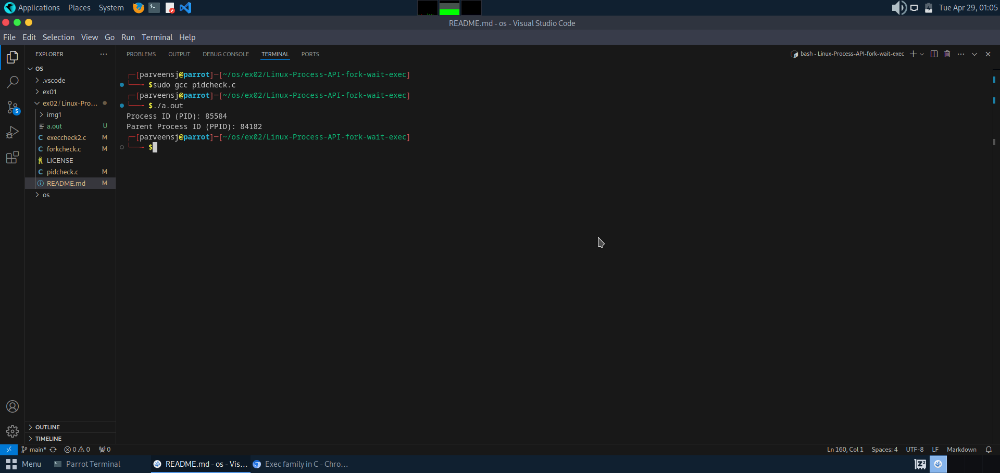
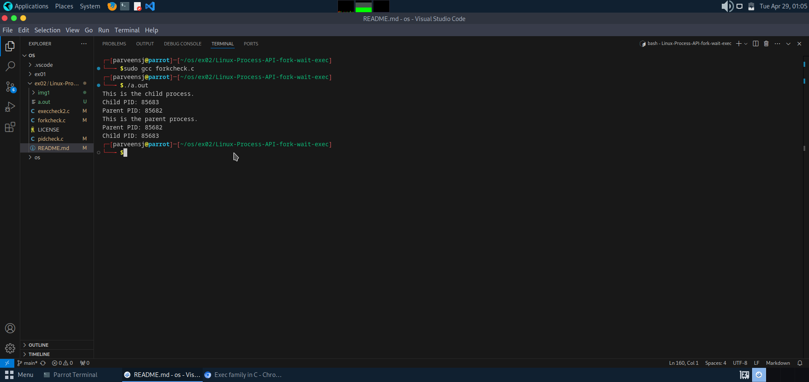
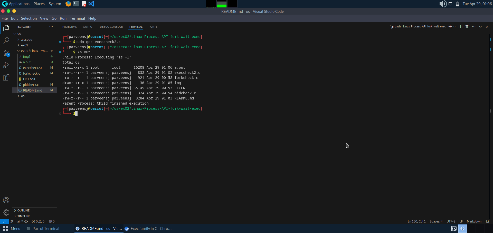

# Linux-Process-API-fork-wait-exec-
Ex02-Linux Process API-fork(), wait(), exec(
# Ex02-OS-Linux-Process API - fork(), wait(), exec()
Operating systems Lab exercise


# AIM:
To write C Program that uses Linux Process API - fork(), wait(), exec()

# DESIGN STEPS:

### Step 1:

Navigate to any Linux environment installed on the system or installed inside a virtual environment like virtual box/vmware or online linux JSLinux (https://bellard.org/jslinux/vm.html?url=alpine-x86.cfg&mem=192) or docker.

### Step 2:

Write the C Program using Linux Process API - fork(), wait(), exec()

### Step 3:

Test the C Program for the desired output. 

# PROGRAM:
## 1.C Program to print process ID and parent Process ID using Linux API system calls

```
#include <stdio.h>    // for printf
#include <unistd.h>   // for getpid and getppid

int main() {
    pid_t pid, ppid;

    pid = getpid();     // Get process ID
    ppid = getppid();   // Get parent process ID

    printf("Process ID (PID): %d\n", pid);
    printf("Parent Process ID (PPID): %d\n", ppid);

    return 0;
}

```


## OUTPUT





## 2.C Program to create new process using Linux API system calls fork() and exit()
```
#include <stdio.h>    // For printf, perror
#include <unistd.h>   // For fork(), getpid(), getppid()
#include <stdlib.h>   // For exit()
#include <sys/types.h> // For pid_t

int main() {
    pid_t pid;

    pid = fork(); // Create a new process

    if (pid < 0) {
        // If fork() returns negative, it means creation of child process failed
        perror("fork failed");
        exit(1);
    }
    else if (pid == 0) {
        // Child process
        printf("This is the child process.\n");
        printf("Child PID: %d\n", getpid());
        printf("Parent PID: %d\n", getppid());
        exit(0); // Child exits
    }
    else {
        // Parent process
        printf("This is the parent process.\n");
        printf("Parent PID: %d\n", getpid());
        printf("Child PID: %d\n", pid);
        exit(0); // Parent exits
    }
}

```
## OUTPUT





## 3.C Program to execute Linux system commands using Linux API system calls exec() family


    
    


```
#include <stdio.h>
#include <stdlib.h>
#include <unistd.h>
#include <sys/types.h>
#include <sys/wait.h>

int main() {
    pid_t pid;

    // Create a new process
    pid = fork();

    if (pid < 0) {
        perror("Fork failed");
        exit(EXIT_FAILURE);
    } else if (pid == 0) {
        // Child process
        printf("Child Process: Executing 'ls -l'\n");
        
        // Replace child process image with 'ls -l' command
        execlp("ls", "ls", "-l", (char *)NULL);

        // If execlp fails
        perror("execlp failed");
        exit(EXIT_FAILURE);
    } else {
        // Parent process
        wait(NULL);  // Wait for child to finish
        printf("Parent Process: Child finished execution\n");
    }

    return 0;
}

```


## OUTPUT





# RESULT:
The programs are executed successfully.
